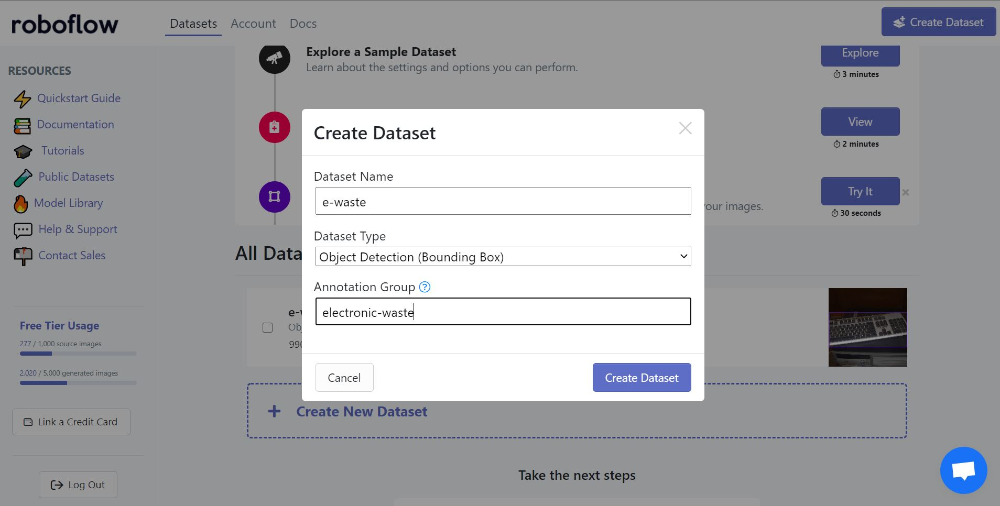
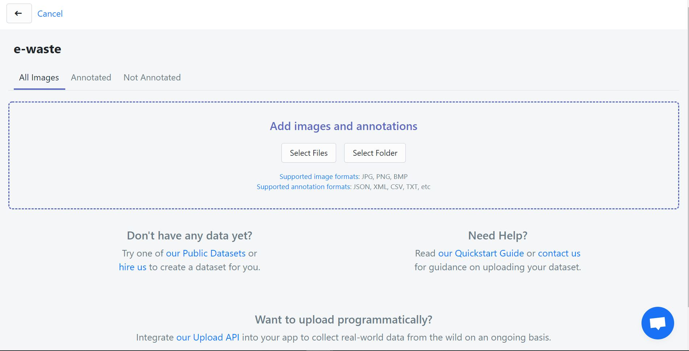
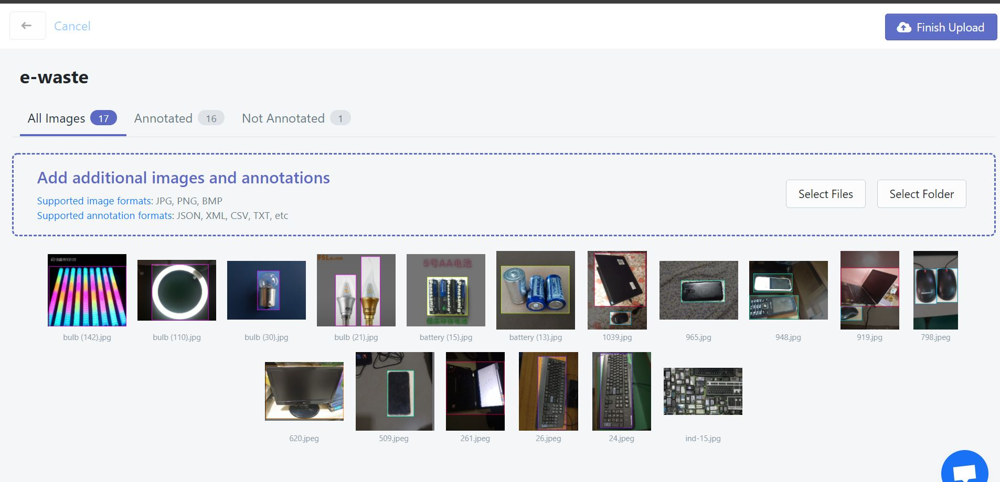
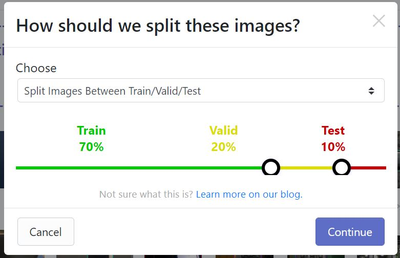
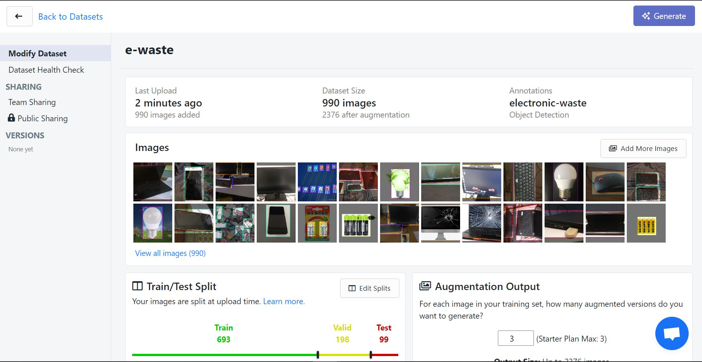
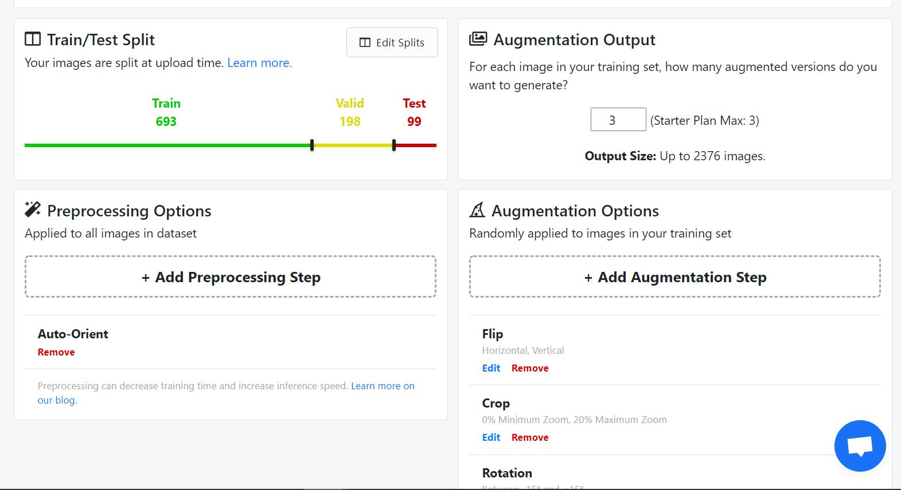
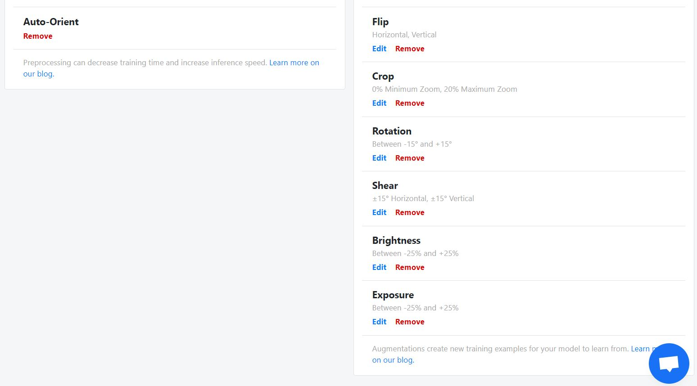
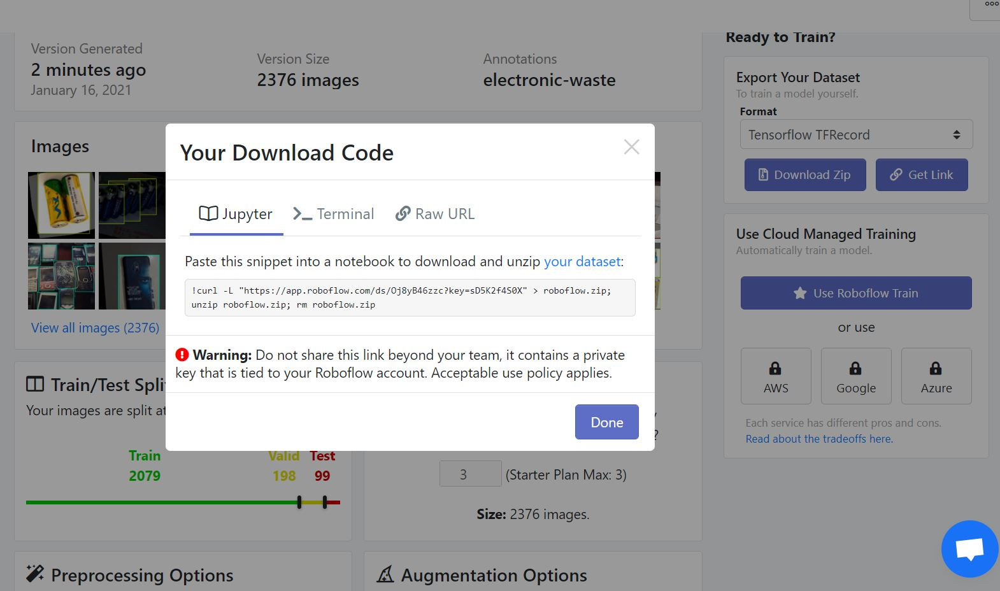

# Dataset

## Data Collection

The datasets mentioned below were combined to form the dataset used for this project:
- https://www.kaggle.com/wangziang/waste-pictures 

- https://www.kaggle.com/kerneler/starter-e-waste-dataset-93b07fb8-a/data 

- Images downloaded from google for Indian context

## Dataset Annotation

Labelling tool uses: [labelImg](https://github.com/tzutalin/labelImg)

LabelImg is a graphical image annotation tool. It is written in Python and uses Qt for its graphical interface. Annotations are saved as XML files in PASCAL VOC format. The instructions to run labelImg for annotations are given in its documentation on Github which is linked above.

### The annotated dataset used for training can be found [here](https://drive.google.com/drive/folders/1Zk47mWlZQYjBsesMEGJjCQNrwDGpB-Tl?usp=sharing)

## Data Preparation

To obtain the final dataset for training in TFRecord format the platform used is [Roboflow](https://roboflow.com/). Image processing and augmentation is also done here.

### Steps:

1. After creating an account on Roboflow one can click on the option of create dataset and give it a name, select its type and annotation group as shown in the image below.
  
    

2. Next, you have to upload the images and the annotations that you would have completed in the data collection and annotation phase. You can either upload the folder with all the contents or upload files individually.
   
    

3. Once the images are upload as seen in the sample screenshot below, you can see that Roboflow notifies you if some images are not annotated and you can add the annotation for those images or remove the image from the dataset. Click on `Finish Upload` once you are satisfied with the images in the dataset.
   
    

4. Then you will be prompted to select how you wish to split the dataset. It is preferable to choose the Train: Valid: Test split since it can minimize the effects of data discrepancies and help us understand the characteristics of the model better.
   
    

5. The image below shows the dataset uploaded for the model trained. 
   1. The train: valid: test split of the dataset is 636 : 128 : 91
   2. Size of dataset before augmentation: 990 images
   3. Size of dataset after augmentation: 2376 images
  
    

6. To perform preprocessing steps or augmentation on the uploaded dataset, you can click on `Add Preprocessing Step` and `Add Augmentation Step` respectively. The interactive GUI assits you in selecting both and you can also alter parameters for augmentation steps like "shear", "crop", "rotation" etc. The sugmentation steps selected by us are:
   
   1. Flip
   2. Crop (min zoom- 0% ; max zoom- 20% )
   3. Rotation (between -15° and 15°)
   4. Shear (Horizontal: +15° ; Vertical: +15°)
   5. Brightness (-25% to +25%)
   6. Exposure (-25% to +25%)
  
    
  
    
  
    Once you have added the augmentations and pre-processing steps you need, click on `Generate Dataset` to generate the final dataset that will be used for training.
   
7. Finally, you will be given the option to either download the zip version of the code in the chosen export format (here the chosen format is TFRecord) or copy the link for the Jupyter notebook which is used in this implementation to load the training dataset for the model.

    

### Now the dataset is ready for implementation which is discussed [here](../implementation)
