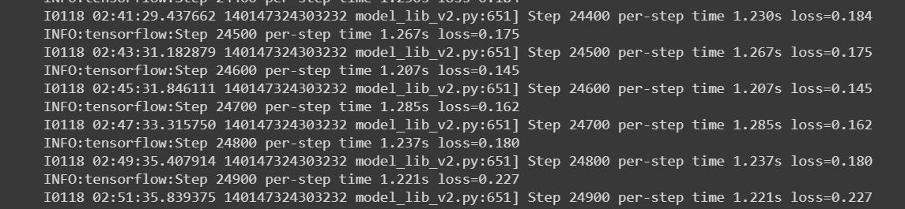
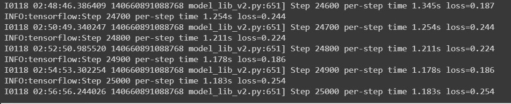

# Results

While both the models were able to detect objects from images of electronic devices that comprise of E-waste, in terms of efficiency the models compare as follows:

## Loss

After running the model for 25000 epochs for `momentum_optimizer` and `adam_optimizer` we get the loss value as 0.254 and 0.227 for the different models obtained as seen in the images below.

### Adam

### Momentum

## Tensorflow Board

### Adam

### Momemtum

